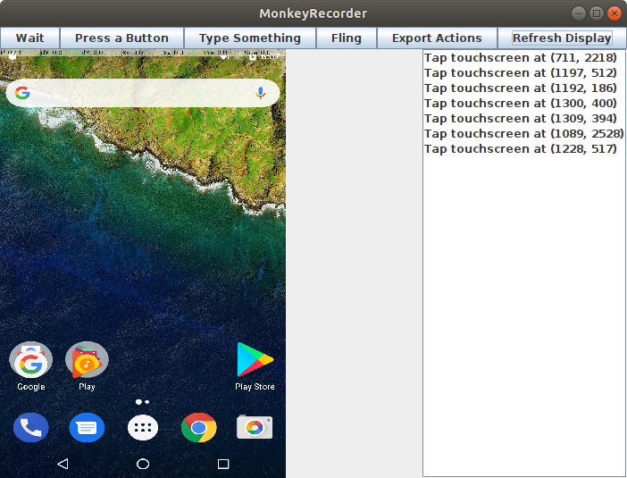

MonkeyRunner - Android Record and Replay UI Testing Framework
========================

Developed for COMS 6998 - Cloud and Mobile Security Seminar - Columbia University - Spring 2013

Abstract—We have developed a user interface driven record and replay system for the Android mobile operating system. By modifying the Android View application programming interface we are able to log interactions within the system to be replayed at a later time using a tool built on top of Googles provided MonkeyRunner framework. This type of user interface replay is useful for testing and debugging as well as more novel applications like system auditing.

A modified android kernel is needed to needed to capture the touch input and create the log. It is not included here due to the size.

download jyson from here: https://opensource.xhaus.com/projects/jyson/files
place the .jar file in your directory so they JSON parsing in the monkeyrunner python scripts run correctly

to run replay:
monkeyrunner -plugin jyson.jar replayLogic.py logfilename.txt

-tag is to include the plug in for JSON
- by default the script looks for testLogicLog.txt if no filename is specified

## Capture input events 

### Using Monkey Recorder

The `monkeyRecorder.py` script can be used to capture input events from the mobile device.
This script requires `monkeyruner`, which should be available when installing ADB.
To run the script, connect the mobile device via ADB and type the following in your terminal:

```
/path/to/monkeyrunner  /path/to/monkeyRecorder.py 
```
    
This will open a window mirroring the mobile device screen.
Monkey Runner will capture all input events performed in the mirror but ignore all events performed directly in the mobile device.
All captured events are logged in the right panel.
You can click in `Export Actions` to export all events logged in this panel.

<p align="center">
    
</p>

**Important**: Monkey Runner it is old, slow and not 100% reliable, but it "works" and allows capturing X and Y coordinates.

## Run captured input events

### Using Monkey Replay

Note that the output file is not directly compatible with the `replay.py` script.
An additional parser is needed to replay the file as it is.

Take the example output from Monkey Recorder:

```text
TOUCH|{'x':711,'y':2218,'type':'downAndUp',}
TOUCH|{'x':1197,'y':512,'type':'downAndUp',}
TOUCH|{'x':1192,'y':186,'type':'downAndUp',}
TOUCH|{'x':1300,'y':400,'type':'downAndUp',}
TOUCH|{'x':1309,'y':394,'type':'downAndUp',}
TOUCH|{'x':1089,'y':2528,'type':'downAndUp',}
TOUCH|{'x':1228,'y':517,'type':'downAndUp',}
```

The equivalent replay file accepted by the `replay.py` script is:

`interaction.txt`
```text
{"type": "touch", "y": 2218, "down": 1, "up": 2, "x": 711 }
{"type": "touch", "y": 512, "down": 3, "up": 4, "x": 1197 }
{"type": "touch", "y": 186, "down": 5, "up": 6, "x": 1192 }
{"type": "touch", "y": 400, "down": 7, "up": 8, "x": 1300 }
{"type": "touch", "y": 394, "down": 9, "up": 10, "x": 1309 }
{"type": "touch", "y": 2328, "down": 11, "up": 12, "x": 1089 }
{"type": "touch", "y": 517, "down": 13, "up": 14, "x": 1228 }
```

Each line must contain the entire input event.
The attributes `down` and `up` represents the duration of the event.
The values of the attributes `down` and `up` must be higher than the previous input. 

Additional events supported by the Monkey Replay script are swiping and pressing a key input (e.g., return button, power button, etc.):

```text
{"type": "drag", "points": [{"x": 200, "y": 350 }, {"x": 400, "y": 250 } ], "down": 1, "up": 2 }
{"type": "press", "keys": [{"key": "KEYCODE_SHIFT_LEFT"}, {"key": "KEYCODE_Y"} ], "down": 3, "up": 4 } 
```

The interaction file is informed to Android Runner via the user config file:

`config.json`
```json
{
  "scripts": {
    "after_launch": "path/to/script/after_launch.py",
    "interaction": [
      {
        "type": "monkeyreplay",
        "path": "path/to/file/interaction.txt"
      }
    ],
    "before_close": "path/to/script/before_close.py"
  }
}
```

Currently, there is no native support in AR to define multiple interactions files in the Monkey Replay format.

### Using Monkey Runner

If someone uses this option, please consider describing here how to use it :-)

It seems to be executed using [MonkeyRunner.py](../AndroidRunner/MonkeyRunner.py)

`config.json`
```json
{
  "scripts": {
    "after_launch": "path/to/script/after_launch.py",
    "interaction": [
      {
        "type": "monkeyrunner",
        "path": "path/to/file/interaction.py"
      }
    ],
    "before_close": "path/to/script/before_close.py"
  }
}
```

### Using Python and ADB 

Alternatively, you can just take the captured X and Y coordinates and write a custom Python script to interact with the mobile device.
This approach is more flexible and easier to debugged in comparison to the Monkey Replay log file.
Consider the following example:

`interaction.py`
```python
import time
from AndroidRunner.Device import Device

default_wait_time = 4

def tap(device: Device, x: int, y: int, sleep = 4) -> None:
    device.shell('input tap %s %s' % (x, y))
    # We need to wait for the display to update after the last click.
    # The time to update is vary. 
    time.sleep(sleep)


def main(device: Device, *args, **kwargs) -> None:
    # Do task 1
    # click ____
    tap(device, 711, 2218)

    # click ____
    tap(device, 1197, 512)

    # click ____ this takes longer to load, wait more time
    tap(device, 1192, 186, default_wait_time * 2)

    # Do task 2
    # click ____
    tap(device, 1300, 400)

    # click ____
    tap(device, 1089, 2528)

    # click ____
    tap(device, 1228, 517)
```

`config.json`
```json
{
  "scripts": {
    "after_launch": "path/to/script/after_launch.py",
    "interaction": [
      {
        "type": "python3",
        "path": "path/to/script/interaction.py"
      }
    ],
    "before_close": "path/to/script/before_close.py"
  }
}
```

Since we are running directly in ADB, we can also easily perform additional interactions, such as swipe and write in writable fields:

```python
import time
from AndroidRunner.Device import Device


def write_text(device: Device, text: str, sleep = 1) -> None:
    device.shell('input text \'%s\'' % text)
    time.sleep(sleep)


def swipe(device: Device, x1: int, y1: int, x2: int, y2: int, sleep = 4, duration = 1000):
    device.shell('input swipe %s %s %s %s %s' % (x1, y1, x2, y2, duration))
    time.sleep(sleep)


def tap_phone_back(device: Device, sleep = 1):
    device.shell('input keyevent KEYCODE_BACK')
    time.sleep(sleep)	
```

 

If you need to define different interactions per subject, you can write the following script:

```python
import time
from AndroidRunner.Device import Device


def subject_1_interaction(device: Device) -> None:
    # input events
    pass


def subject_2_interaction(device: Device) -> None:
    # input events
    pass


def subject_3_interaction(device: Device) -> None:
    # input events
    pass


def main(device: Device, *args, **kwargs) -> None:
    if device.current_activity().find('subject_1_android_app_package OR URL 1') != -1:
        subject_1_interaction(device)
    elif device.current_activity().find('subject_2_android_app_package OR URL 2') != -1:
        subject_2_interaction(device)
    elif device.current_activity().find('subject_3_android_app_package OR URL 3') != -1:
        subject_3_interaction(device)
    else:
        raise Exception('There is no known interaction script for this subject')
```
