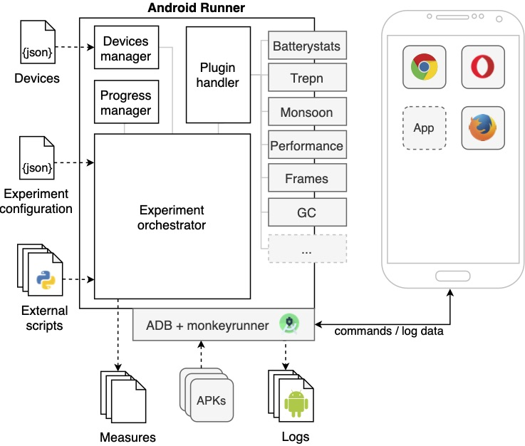

[](https://sonarcloud.io/dashboard?id=S2-group_android-runner)
[](https://travis-ci.org/S2-group/android-runner)
[](https://coveralls.io/github/S2-group/android-runner?branch=master&service=github)
# Android Runner
Android Runner (AR) is a tool for automatically executing measurement-based experiments on native and web apps running on Android devices.

The following scientific publication gives an overview about the main components, plugins, and configurations of Android Runner (as of 2020): [A-Mobile 2020 publication](https://github.com/S2-group/android-runner/blob/master/documentation/A_Mobile_2020.pdf)  

A complete tutorial on how to use Android Runner is available in the following YouTube playlist: [Android Runner Tutorials (YouTube)](https://www.youtube.com/watch?v=-ZXT176ljjI&list=PLLbZZOioDh3P50WcYbuBMZEJokJH3ZONr)    

As visualized below, Android Runner consists of the following components:
- **Experiment orchestrator**: Is in charge of executing the whole experiment according to the experiment configuration provided by the user.
- **Devices manager**: Is responsible for providing a layer of abstraction on the low-level operations involving the Android devices.
- **Progress manager**: Keeps track of the execution of each run of the experiment.
- **Plugin handler**: Provides a set of facilities for managing the profilers and an extension point that third-party developers can use for integrating their own measurement tools into Android Runner.

<p align="center">

</p>

## How to cite Android Runner

If Android Runner is helping your research, consider to cite it as follows, thanks!

``` 
@inproceedings{A_Mobile_2020,
  title={{A Framework for the Automatic Execution of Measurement-based Experiments on Android Devices}},
  author={Ivano Malavolta and Eoin Martino Grua and Cheng-Yu Lam and Randy de Vries and Franky Tan and Eric Zielinski and Michael Peters and Luuk Kaandorp},
  booktitle={35th IEEE/ACM International Conference on Automated Software Engineering Workshops (ASEW '20)},
  year={2020},
  url= {https://github.com/S2-group/android-runner/blob/master/documentation/A_Mobile_2020.pdf},
  organization={ACM}
}
```

## Setting up environment, installation and dependencies
Instructions can be found [here](https://github.com/S2-group/android-runner/blob/master/CONTRIBUTING.md).  Instructions for specific plugins are included in the plugins' READMEs.

## Quick start
To run an experiment, run:
```bash
python3 android-runner path_to_your_config.json
```
Example configuration files can be found in the subdirectories of the `examples` directory.

## Structure
### devices.json
A JSON config that maps devices names to their adb ids for easy reference in config files.

### Experiment Configuration
Below is a reference to the fields for the experiment configuration. It is not always updated.

**adb_path** *string*
Path to adb.  Normally don't need to include.  Example path: `/opt/platform-tools/adb`

**monkeyrunner_path** *string*
Path to Monkeyrunner. Example path: `/opt/platform-tools/bin/monkeyrunner`

**type** *string*
Type of the experiment. Can be `web`, `native` or `plugintest`

**devices_spec** *string*
Specify this property inside of your config to specify a `devices.json` outside of the Android Runner repository. For example:

 ```js
 {
   // ....
   "type": "native",
   "devices_spec": "/home/user/experiments/devices.json",
   "devices": {
     "nexus6p": {}
   },
   // ...
 }
 ```

**repetitions** *positive integer*
Number of times each application is profiled in an experiment.

**clear_cache** *boolean*
Clears the cache before every run for both web and native experiments.  Default is *false*.

**randomization** *boolean*
Random order of run execution. Default is *false*.

**duration** *positive integer*
The duration of each run in milliseconds, default is 0. Setting a too short duration may lead to missing results when running native experiments, it is advised to set a higher duration time if unexpected results appear.

**reset_adb_among_runs** *boolean*
Restarts the adb connection after each run.  Default is *false*.

**time_between_run** *positive integer*
The time that the framework waits between 2 successive experiment runs. Default is 0.

The **usb_handler** option enables Android Runner to disable the USB connection during each run (while AR is profiling) and enables it after the run. This allows
devices to charge inbetween runs. In addition, some (energy) profilers can only provide accurate measurements when there is no charge flowing into the battery during profiling. To use this option the device(s) should be connected to ADB using WiFi.
The option expects a JSON object with "enable_command" and "disable_command" as keys and the corresponding commands as values.

```js
"usb_handler" : {
                "enable_command"  : "uhubctl -l 2 -a 1",
                "disable_command" : "uhubctl -l 2 -a 0" 
                }
```
The example above uses [uhubtl](https://github.com/mvp/uhubctl), an utilitiy that makes it possible to programmatically enable and disable USB port(s). Please note
uhubctl is only compatible with a selection of devices (see the full list on GitHub). We have used and tested uhubctl primarily on a Raspberry PI 4B. There are a few caveats when using uhubctl on the Raspberry PI 4B:
- You cannot specify which USB port to enable or disable. Either ALL USB ports are enabled or ALL USB ports are disabled.
- When a USB block/mass storage device is connected, in addition to your device(s) under test, it is likely that the power will turn back on after a few seconds. This is caused by the fact that some device drivers in the kernel are surprised by USB device being turned off and automatically try to power it back on.
The easiest way to fix this issue to disconnect the USB block/mass storage. An alternative is to use the `udiskctl`, see [here](https://github.com/mvp/uhubctl#usb-devices-are-not-removed-after-port-power-down-on-linux) for more info.

The **run_stopping_condition** makes it possible to stop the current run when a specific event is triggered. If no event is triggered the run will continue as usual. Right now there are 3 supported events. When the logcat_regex or post_request conditions are used users can also stop the run by using the stop() function call.

1. A regex in the logcat is matched.

      With the configuration below AR continuously checks if the device's logcat contains an entry matching the "\<expr\>" where "\<expr\>" is a regular expression. If this is the case the run will be stopped. Please note that the `regex` option is required to specify the regex.
      ```js
      "run_stopping_condition" : {"logcat_regex" : {"regex" : "<expr>"}}
      ```
2. The reception of an HTTP POST request.

    With the configuration below AR will start a local webserver on port 2222 which accepts HTTP POST requests to stop the run. The payload of these HTTP POST requests are saved to the output directory. The file format will be .json if the Content-type header is `application/json` and .txt otherwise.
    ```js
    "run_stopping_condition" : {"post_request" : {"server_port" : 2222}}
    ```
    The `server_port` option is optional. If it is not provided the local webserver will be started on port 8000. 
    
    For tips on how to use this option in practice consider checking out this [guide](./docs/run_stop_condition_http_post_tips.md).

3. A direct call of the stop() function on an Experiment instance.   

    With the configuration below AR allows one to call the stop() method on an AndroidRunner.Experiment instance to stop the current run.  
    ```js
    "run_stopping_condition" : {"function" : {}}
    ```
    This can be useful in an interaction script when we want to stop the run if some condition holds. The current Experiment instance can be accessed by `args[0]`. An example which stops the run if "certain app" is installed on the device.
    ```py
    def main(device, *args, **kwargs):
      if device.is_installed("certain app"):
        args[0].stop()
    ```

**devices** *JSON*
A JSON object to describe the devices to be used and their arguments. Below are several examples:
```js
  "devices": {
    "nexus6p": {
      "root_disable_charging": "True",
      "logcat_buffer_size" : 64,
      "charging_disabled_value": 0,
      "usb_charging_disabled_file": "/sys/class/power_supply/usb/device/charge",
      "device_settings_reqs": {"e.www.gyroscopetest": ["location_high_accuracy", ...], ...}
      }
    }
  }
```

```js
  "devices": {
    "nexus6p": {
      "root_disable_charging": "False"
    }
  }
```

```js
  "devices": {
    "nexus6p": {}
  }
```
The **logcat_buffer_size** option specifies the size of the logcat buffer in KB (1KB = 1024 Bytes) for the given device. This must be an integer between 64 and 262144 (which is 256MB in KB). If this value is not set a default value of 131072KB (128MB) is used.

Note that the last two examples result in the same behaviour.

The **root_disable_charging** option specifies if the devices needs to be root charging disabled by writing the **charging_disabled_value** to the **usb_charging_disabled_file**. Different devices have different values for the **charging_disabled_value** and **usb_charging_disabled_file**, so be careful when using this feature. Also keep an eye out on the battery percentage when using this feature. If the battery dies when the charging is root disabled, it becomes impossible to charge the device via USB.

**device_settings_reqs** can be set to programmatically enable and disable settings on the test device for native apps.  It was added to automate the process of turning on and off location services in a randomized experiment where some applications required it and others that didn't.  Two options available currently: location services with the help of Google and one without.  **location_high_accuracy** is the option for location services with Google; **location_gps_only** is the other.  More adb commands are likely to be added in the future that work for other sensors and settings.  Turn off location services before the experiment starts.

**WARNING:** Always check the battery settings of the device for the charging status of the device after using root disable charging.
If the device isn't charging after the experiment is finished, reset the charging file yourself via adb su command line using:
```shell
adb su -c 'echo <charging enabled value> > <usb_charging_disabled_file>'
```

**paths** *Array\<String\>*
The paths to the APKs/URLs to test with. In case of the APKs, this is the path on the local file system.

**apps** *Array\<String\>*
The package names of the apps to test when the apps are already installed on the device. For example:
```js
  "apps": [
    "org.mozilla.firefox",
    "com.quicinc.trepn"
  ]
```

**browsers** *Array\<String\>*
*Dependent on type = web*
The names of browser(s) to use. Currently supported values are `chrome`, `firefox` and `opera`.

**profilers** *JSON*
A JSON object to describe the profiler plugins to be used and their arguments. Below, an example is found:
```json
  "profilers": {
    "trepn": {
      "sample_interval": 100,
      "data_points": ["battery_power", "mem_usage"]
    },
    "android": {
      "sample_interval": 100,
      "data_points": ["cpu", "mem"],
      "subject_aggregation": "user_subject_aggregation.py",
      "experiment_aggregation": "user_experiment_aggregation.py"
    }
  }
```
Currently, Android Runner contains the plugins listed below, they can immediately be used as for an experiment.

| Name (quality attribute)                                                 | Description                                                                                                                                                                                                                                                                                 |
|--------------------------------------------------------------------------|---------------------------------------------------------------------------------------------------------------------------------------------------------------------------------------------------------------------------------------------------------------------------------------------|
| [batterystats](./AndroidRunner/Plugins/batterystats/) (Energy)  | Uses the `batterystats` utility and estimates energy consumption via the algorithm proposed in [this article](https://ieeexplore.ieee.org/stamp/stamp.jsp?arnumber=7884613&casa_token=oEEnY7XOip8AAAAA:AyRZxwboUh55-n9vmW5NGT62mL_hv85T4wPGWlDQGJ36VpF3bcAV1ufvYBhsYxlB0lIMOYJ_Hc-O&tag=1). |
| [monsoon](./AndroidRunner/Plugins/monsoon/) (Energy)            | Collects energy consumption via the Monsoon hardware profiler and the [Physalia tool](https://github.com/TQRG/physalia).                                                                                                                                                                   |
| [trepn](./AndroidRunner/Plugins/trepn/) (mixed)                 | Collects data via the Trepn profiler, e.g., power consumption, battery temperature, CPUs frequency.                                                                                                                                                                                         |
| [mem-CPU](./AndroidRunner/Plugins/android/) (Performance)       | Collects memory and CPU usage via the `cpuinfo` and `meminfo` Android utilities found in ADB's [dumpsys](https://developer.android.com/studio/command-line/dumpsys).                                                                                                                        |
| [frametimes](./AndroidRunner/Plugins/frametimes/) (Performance) | Collects frame rendering durations and the number of delayed frames with the technique used in [this article](https://dl.acm.org/doi/pdf/10.1145/2897073.2897100?casa_token=jD3bYLV001kAAAAA:OZiAzZFwtvSO-uK3hgWlz6iNVcTt6uYoT1UWroDEGhDHrEBvLbsIl4E13RhAtRK4IaEPd6putLTzzZw).              |
| [gc](./AndroidRunner/Plugins/trepn/) (Performance)              | Collects the number of garbage collections as in [this article](https://dl.acm.org/doi/pdf/10.1145/2897073.2897100?casa_token=jD3bYLV001kAAAAA:OZiAzZFwtvSO-uK3hgWlz6iNVcTt6uYoT1UWroDEGhDHrEBvLbsIl4E13RhAtRK4IaEPd6putLTzzZw).                                                            |
| [perfume_js](./AndroidRunner/Plugins/perfume_js/) (Performance)              | Collects performance metrics using the `Perfume.js` library, e.g. FP, FCP, NavigationTiming, storageEstimate and networkInformation.                                                            |
| [Perfetto](./AndroidRunner/Plugins/perfetto) (mixed) | Collects data using [Perfetto](https://perfetto.dev/) which supports various data sources including memory, CPU, power and more. |
> Did you develop a plugin for Android Runner? You can [create a pull request](https://github.com/S2-group/android-runner/pulls/new) in this repository and we will include it!

The profiler section may accept custom aggregation [scripts](https://github.com/S2-group/android-runner/tree/master/AndroidRunner/Plugins/garbagecollection).  If a user specified aggregation script is used then the script should contain a ```bash main(dummy, data_dir, result_file)``` method, as this method is used as the entry point to the script.  The aggregation options are as follows:

**subject_aggregation** *string*
Specify which subject aggregation to use. The default is the subject aggregation provided by the profiler.

**experiment_aggregation** *string*
Specify which experiment aggregation to use. The default is the experiment aggregation provided by the profiler.

**scripts** *JSON*
A JSON list of types and paths of scripts to run. Below is an example:
```js
"scripts": {
  "before_experiment": "before_experiment.py",
  "before_run": "before_run.py",
  "interaction": "interaction.py",
  "after_run": "after_run.py",
  "after_experiment": "after_experiment.py"
}
```
Below are the supported types:
- **before_experiment**
  executes once before the first run
- **before_run**
  executes before every run
- **after_launch**
  executes after the target app/website is launched, but before profiling starts
- **interaction**
  executes between the start and end of a run
- **before_close**
  executes before the target app/website is closed
- **after_run**
  executes after a run completes
- **after_experiment**
  executes once after the last run

Instead of a path to string it is also possible to provide a JSON object in the following form:
```js
    "interaction": [
      {
        "type": "python3",
        "path": "Scripts/interaction.py",
        "timeout": 500,
        "logcat_regex": "<expr>"
      }
   ]
```
Within the JSON object you can use "type" to "python3", "monkeyrunner" or, "monkeyreplay" depending on the type of script. "python3" can be used for a standard python script,  "monkeyreplay" for running a Monkeyrunner script with the use of the Monkeyrunner framework and "monkeyrunner" can be used to run a Monkeyrunner directly without the entire Monkeyrunner framework. The "timeout" option is to set a maximum run time in miliseconds for the specified script. The optional option "logcat_regex" filters the logcat messages such that it only keeps lines where the log message matches "\<expr\>" where "\<expr\>" is a regular expression.

## Plugin profilers
It is possible to write your own profiler and use this with Android Runner. To do so write your profiler in such a way
that it uses [this profiler.py class](AndroidRunner/Plugins/Profiler.py) as parent class. The device object that is mentioned within the profiler.py class is based on the device.py of this repo. To see what can be done with this object, see the source code [here](AndroidRunner/Device.py).

You can use your own profiler in the same way as the default profilers, you just need to make sure that:
- The profiler name is the same as your python file and class name.
- Your python file isn't called 'Profiler.py' as this file will be overwritten.
- The python file is placed in its own directory inside the directory called 'Plugins'; the name of the directory must be in lowercase

To test your own profiler, you can make use of the 'plugintest' experiment type which can be seen [here](examples/plugintest/)

## Experiment continuation
In case of an error or a user abort during experiment execution, it is possible to continue the experiment if desired. This is possible by using a ```--progress``` tag with the starting command. For example:

```python3 android_runner your_config.json --progress path/to/progress.xml```

## Compatible Devices
The table below shows on which mobile devices Android Runner and its profilers were tested and whether there are any known issues.

| Device/Profiler             	| Trepn                                                	| BatteryStats 	| Perfetto*      	|
|-----------------------------	|------------------------------------------------------	|--------------	|----------------	|
| LG Nexus 5X (Android 8.1.0) 	| No, energy consumption measurements always return 0. 	| Yes          	| Not applicable 	|
| Samsung Galaxy J7 Duo       	| No, energy consumption measurements always return 0. 	| Yes          	| Not applicable 	|
| Google Pixel 3              	| No, energy consumption measurements always return 0. 	| Yes          	| Yes            	|
| Google Pixel 5G             	| No, energy consumption measurements always return 0. 	| Yes          	| Yes            	|
* Please note that Perfetto may not be suited for doing energy consumption measurements, see [https://github.com/S2-group/android-runner/tree/master/AndroidRunner/Plugins/perfetto#limitations-issues--caveats](here).

